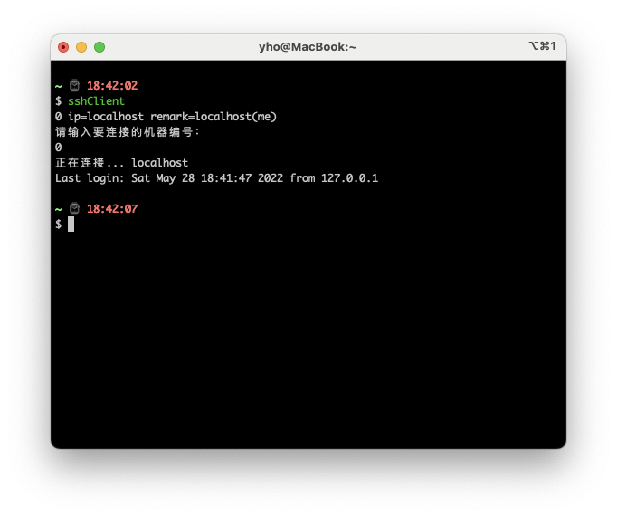

安装步骤
1.MAC

```
1.执行安装依赖和程序
go mod tidy
go build main.go
2.将main可执行文件和conf配置目录放置到自有的安装目录
3.配置执行环境
vim ~/.bash_profile
alias sshClient="安装目录/main; exit"
4.在终端执行sshClient
5.上传下载文件可以使用rzsz配置查看下方链接
```




[item2使用rzsz](https://github.com/wlyxtx/iterm2-zmodem)

